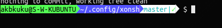

xonsh Configuration
-------------------

My configuration for `xonsh`. I found myself needing `$PROMPT` to look different
so I remember I'm using an enhanced shell.

It's sort of a [Powerline](https://github.com/b-ryan/powerline-shell) rip-off.
There is a version of [Powerline for xonsh](https://github.com/santagada/xontrib-powerline)
, but I only wanted the highlighted background, not any of the other fancy
features. I used the [fonts](https://github.com/powerline/fonts) to achieve the
clean transitions though.

I've noticed that the fonts look good in [Yakuake](https://yakuake.kde.org/),
but there is a kerning issue with the Powerline patched characters in konsole
that causes them to overlap.

